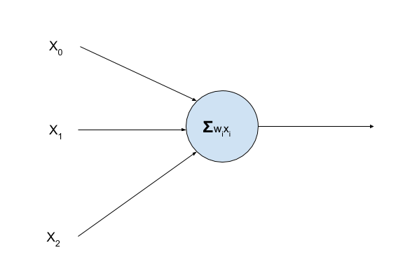

# Deep Reinforcement Learning: From Zero to Hero
This post is my attempt to wrap my head around deep reinforcement learning. Hopefully, you will find it useful. However, note that I am by no means an expert on the subject so if something in my writing is amiss, let me know.

Outline:
1. Motivating Examples
2. Deep Reinforcement Learning Context
3. Reinforcement Learning Math Background
4. Deep Q Learning
5. Limitations of Deep Q Learning
6. Policy Methods
7. Experiences

## Motivating Example
We will use the [OpenAI Gym](https://gym.openai.com/) as the environment. More specifically, we will play [Breakout](https://gym.openai.com/envs/Breakout-v0/). Breakout has some advantages here. Firstly, the rules and scoring are quite simple so that the game is easily accessible at a glance. Secondly, the possible actions taken by the player are extremely simple: do nothing, move left, or move right.

### Install OpenAI Gym
	pip install gym
	
### Introduction to the Environment
	import gym
	import time
	env = gym.make("BreakoutDeterministic-v4")
	for game in range(5):
	    done = False
	    state = env.reset()
	    score = 0
	    step = 0
	    while not done:
	        env.render()
	        action = env.action_space.sample()
	        next_state, reward, done, _ = env.step(action)
	        time.sleep(0.1)
	        score += reward
	        if done:
	            break
	        step += 1
	    print("Game {:2d} Completed in {:4d} steps with score {}".format(game, step+1, score))
	env.close()

If you execute the above code in your own environment, you will see that each "game" in breakout has five "lives" where each life ends when the ball falls to the bottom of the screen. You will also notice that despite an apparent large number of game steps that the scoring is extremely low. Indeed, virtually all rewards seen by this agent are zero. As we will see, this is an important characteristic of reinforcement learning problems. 

Now let's take a look at what happens when an agent trained using deep reinforcement learning against this environment. Below is the video demonstrating DeepMind's success against breakout. 

As indicated in the [DQN paper](https://www.cs.toronto.edu/~vmnih/docs/dqn.pdf), the trained agent achieved an average game score of 168 far exceeding the average human score of 31. For at least this example, deep reinforcement learning is phenomenally successful. Let's figure out why.

## Deep Reinforcement Learning Context
Let's take a step back to see where Deep Reinforcement Learning fits in the artificial intelligence universe. Machine learning is just one approach to achieving artificial intelligence. Over the past couple of decades, machine learning has been the dominant approach to achieving artificial intelligence. Machine learning refers to algorithmic techniques to learn from data describing the world. Within machine learning there are a few alternative approaches. Figure 1 below illustrates the overall AI and machine learning universe. 

### Supervised Learning
Supervised learning is the most commonly used approach. In supervised learning, a set of labeled training examples is provided as input. The goal of the system is to generate a function that best captures the relationship between the input features and the known **truth** values. An example might be to estimate whether or not your car needs maintenance based on all of the input sensors. In this case, expert mechanics might be asked to look at the sensor inputs and offer their judgements as to whether or not maintenance is required. At its most basic, an example of supervised learning would be a simple linear regression.

### Unsupervised Learning
Unsupervised learning is, in contrast, where the system learns to represent the data in the absence of any truth values. What is this representation? Going back to the car analogy, the task would no longer be to identify something actionable like whether the car needs maintenance. Instead, the unsupervised learning system might form similar models of "cars" based on these sensor inputs. In the ideal case, maybe the system even learns some model of a car that needs maintenance (though it would not be able to tell you that's what it learned). 

### Reinforcement Learning
In reinforcement learning, an agent learns by interacting with the environment and receiving some reward in response. At first blush, such a system seems quite similar to supervised learning. However, these rewards are far different from truth values provided into a supervised learning system. Going back to the breakout problem in the introduction, there might be no rewards - neither positive nor negative - offered for hundreds of consecutive time steps in the game *even when the game is played perfectly*. Think about what that means for a moment. There is simply no guidance provided as to whether the agent did something correctly or not. 

### Deep Learning
Deep learning is a technique used in machine learning tasks and can be applied to any of these broader techniques.

Deep learning is really just an artificial neural network (ANN) with one or more hidden layers (and new branding!). The structure of a simple feed-forward network is shown in the figure below.

Deep learning has had phenomenal success in recent years. There are a few reasons why deep learning has been so successful:
- The [Universal Approximation Theorem](https://en.wikipedia.org/wiki/Universal_approximation_theorem) shows that a neural network exists to model *any* relationship between inputs and outputs. 
- [Backpropagation](https://en.wikipedia.org/wiki/Backpropagation) provides an automated training technique for a neural network.
- For supervised learning, there is now a vast collection of labeled data available.
- Growth in computing power and the [application of GPUs to neural networks](http://www.machinelearning.org/archive/icml2009/papers/218.pdf).

The math of the network is relatively straightforward. At a given layer, each node has connections to some subset of the nodes in the next layer. Each of these connections is given some weight. The input value to a given node at a given layer is the summation of the value of the source node for each connection multiplied by the weight assigned to that connection. We can consider the weights for a given layer as a vector and then perform a matrix multiplication of that weight vector by the input feature vector and add in a bias.

where H is the number of hidden layers, W is the weight vector for each layer, and the zeroth layer is the input layer. 

We need one additional feature in order for this generalized network to approximate the complex functions hidden within our data. The missing feature is an **activation function**. An activation function is a nonlinear function applied to the output of a given layer in the network. Without a nonlinear function, it is not possible for the network to represent anything other than linear functions and that would be quite disappointing for this post. 

For the hidden layers, the most common activation function is the **ReLU** or **Re**ctified **L**inear **U**nit. This function is a simple piece-wise linear function and behaves as an on-off switch for a given unit. The function is absurdly simple and produces quite the obvious output.

which looks like the following for arbitrary input x. 

For the output layer, the activation function needs to map to your problem domain. For example, if the task is to produce a binomial classifier (think "dogs vs cats") then the sigmoid activation function might be useful.

What this function does is it drives higher valued inputs to the value *1* and lower valued inputs to the value *0*. Maybe *1* maps to dogs and *0* maps to cats in your system. Then you can think of this function as producing a value that is the probability that the input is a dog.

Finally, after we have the structure of our network, we need the ability to train the network using backpropagation. The idea is that first we calculate the error in the network result versus a truth result. Then we walk backwards through the network adjusting weights where the delta in the weights is driven by the contribution of that node's weight to the total error. That is, we adjust the weight of a node by the gradient of the error versus the node weight multiplied by some constant learning rate.

That's a little abstract. Let's work our way up to that by looking at a network with a single layer. The output of our single layer of weights multiplied by the input vector yields our predicted output. That prediction versus our truth value forms our error. We can find the contribution of each node in the output layer to our error by multiplying the **input** to that node versus that output error. 

Why does this make sense? Consider the trivial example where the input to a node is 0. Then that node necessarily has no impact on the output. So, it would not make sense to adjust the weight of that node in response.

That logic works well enough for a single layer but what about when we have multiple hidden layers? Consider the case where we set the learning rate to 1.0 in order to force the network to immediately match the output. In that case, if we simply used the logic outlined above at each hidden layer, we would overcompensate for the error and we still wouldn't match. So, instead of using the network output error at each layer multiplied by the input to that layer, we'll use the error from the next layer multiplied by the weights entering that layer. This is what is meant by backpropagation. The computation is run in reverse.

an

for some learning rate alpha.
 
Finally, I'll note a major caveat with this description of backprop: I included only linear units for simplicity. Nonlinear units have their own gradients that must be properly accounted for. You would be justified to have concern about the programming effort required to implement all of this. Fortunately, [autograd](https://pytorch.org/tutorials/beginner/blitz/autograd_tutorial.html) is there to save the day. I won't go into details on autograd here but I'll note that the pytorch framework tracks all computations leading to the output value without requiring any data management on your part. Included in that tracking is the gradient of each computation. Backprop is then safe and easy. 

That covers the basics of deep learning. However, our target problem concerns learning from pixels and that problem domain has a specific deep learning architecture that we need to discuss.

### Convolutional Neural Networks
A good explanation is [here](http://cs231n.github.io/convolutional-networks/) but I'll walk through this quickly anyway. *Note that in this discussion I will use the terms kernel and filter interchangeably.*

A Convolutional Neural Network or CNN is a mechanism of extracting features from images at different levels of abstraction. For simplicity, we'll start by discussing gray-scale images of a given height and width. Such an image has height*width total pixels and each of those pixels has a value corresponding to the brightness of that pixel. The image can then be manipulated as a two-dimensional matrix. Rather than performing the operation on a real image, first we'll make a simple 3x3 "image" and use that to illustrate the mathematics.
	
	array([[1, 2, 3],
	       [4, 5, 6],
	       [7, 8, 9]])

We are going to "convolve" this image with a 2x2 *kernel*.

	array([[1, 0],
	       [0, 1]]) 

What we are going to do is take the dot product of each 2x2 section of the source image with the 2x2 kernel. For example, the pixel at the 0,0 position in the output image will have value of

More generally

where O is the output image and m and n are the respective offsets in the image. You can imagine this as sliding a 2x2 filter across the input matrix row by row until you have covered the entire image. Note that this operation can only be performed twice for each row in the matrix. More generally, as defined above we can establish the size of the output image in a given direction from the input image size in that direction and the kernel size in that direction:

where the *K-1* comes from the fact that the overlap in the image will be the length of the kernel minus 1.

This is referred to as "valid" padding. That is, every pixel in the output image is computed only using input image pixels and the kernel. Meanwhile, "same" padding is the alternative where enough zeroes are appended into the image in order that the output image has the same shape as the input image.

What if, on the other hand, you decided that there was no need to perform this operation on every possible sub-matrix in the image? Instead, maybe you want to start with your m,n moving by two pixels at a time? That is called the *stride* of the convolution. As you might guess, that also goes into determining the shape of the output image leading to the final equation:

where s is the stride and P has a value of 0 for valid padding and a value of 1 for same padding. 

Now, let's look at what these operations can accomplish using an image of US astronaut Eileen Collins. Here is the source image.

Next, let's convert this to gray-scale to reduce the number of input channels from 3 to 1 using the skimage.transform module.

	from skimage import color
	gray_image = color.rgb2gray(astronaut_image)
	

Now let's define a simple edge-detection 3x3 kernel.

	edge_filter = np.array([[-1,-1,-1],[-1,8,-1],[-1,-1,-1]])

Why is this an edge detection filter? Consider the result if every pixel in a 3x3 subsection of the input image has the same intensity. Then the resulting value of our convolution is 0. On the other hand, a difference in intensity between neighboring pixels results in intensity in the output image. Below is a simple convolution source code

	# convolution code derived from 
	# http://machinelearninguru.com/computer_vision/basics/convolution/image_convolution_1.html
	def convolve(img, kernel):    
	    """assume 3x3 kernel shape"""
	    # construct an output array of the same size as the input image
	    output = np.zeros_like(img)
	    
	    # create a padded image so that we can convolve through the whole thing, "same" padding
	    image_padded = np.zeros((img.shape[0] + kernel.shape[0]-1, img.shape[1]+kernel.shape[1]-1))
	    image_padded[1:-1,1:-1] = img
	    for x in range(img.shape[1]):
	        for y in range(img.shape[0]):
	            output[y,x] = (kernel * image_padded[y:y+3,x:x+3]).sum()
	    return output

And the resulting output image is

Now that we've seen the convolution operation, how do we bring this back up to a convolutional neural network? The key is how do you decide what filters will actually be critical for the problem at hand. Rather than hand-coding a filter as I did above, we can have the network learn what filters to use. When we define a CNN, we specify to the network the shape of the kernel, the stride, the padding, and how many of these kernels to construct. Going back to the edge detection filter it is quite unlikely that the output of that convolution would be enough to solve our problem. But, the combined output of a bunch of different kernels with different values may actually do the trick. 

Referring back to the input image we are using. The size of that image is 512x512. If we constructed 64 filters, then our output image will have 64 layers or channels. If we assume for the moment that we are using "same" padding and a stride of 1, then we'd produce 64 output images each of shape 512x512. More generally, we describe the shape as

This also illustrates how you might handle conventional RGB image input. Each color is a channel. Tying this back to the earlier discussion of deep learning you can now see that the input to a given node in the network is influenced by some subset of the pixels from each of the input channels. Critically, that subset is driven by the kernel size meaning that the input into a node is driven only by those pixels near the current node in the 2d image. Finally, a CNN is just a particular network architecture. The basic rules about matrix multiplication on non-linearity still apply so we'll apply a ReLU activation function after the convolution.

There's only one more topic to discuss with CNNs. In the hypothetical example above, the size of the next layer was increased to 64x512x512. It seems that this could be problematic if we continued increasing the number of weights in each layer. In the object recognition domain, an operation called *max pooling* is used to reduce the complexity of the next layer by summarizing a sub-region in the image by using only the maximum value in that sub-region. This approach has an advantage in that it makes the image invariant to translation and rotation. In our case, the atari breakout image is fixed and the exact location is critical. Therefore, we'll use valid padding, stride, and kernel size to reduce the image size instead.

With that, we are ready to move on to reinforcement learning and see how deep learning is applied in that context. 
## Reinforcement Learning
Reinforcement learning predates deep learning and provides the framework into which we will insert deep learning. 

First, let's define a policy as a function that maps some state into an action. 

It is important to note that this relationship need not be deterministic. Now, let's define the *value* of some state with respect a given policy.

What this is saying is that the value of a state can be expressed as the sum total of all expected future rewards while following a given policy.

Let's make one change to the above equations where we introduce an exponential discount on future rewards. You can consider this the "a bird in the hand is worth two in the bush" extension.

We can take this a bit farther and define the state-value function for a given policy.

This is essentially a restatement of the earlier value function where we now include the expected return from a specific action while in state s. 

Bringing this altogether, what we would like to find is the optimal policy.

That optimal policy would be the one that returns the action that maximizes the state value function.

How might we find such an optimal policy? The obvious answer would be to play all possible games while tracking the ultimate game score received for taking actions at a given state. Then, the optimal action is merely the action that maximizes the mean game score from taking the action. That is clearly not a viable option for most problems that we would be interested in. We can approximate that value function by executing a monte carlo simulation but that would still fall apart under virtually all games of interest. See the breakout game above. The input is 210x164x3 meaning that the state space is a 110800 dimensional vector where each unit has a range of 256 possible values yielding over 25 million unique input images. That is the input state size for a given timestep and, as noted earlier, there may be thousands or tens of thousands of timesteps for a single game. It is simply infeasible to approximate the function in this manner.

This is where deep learning comes to the rescue. We will use deep learning to learn a function that approximates that mapping from the input state to value.
## Deep Q Learning
The paper introducing Deep Q Networks or DQN uses a convolutional neural network (CNN) to approximate that value function. Let's back up for a second to go through CNNs.

### DQN Algorithm

There are a few techniques embedded in this algorithm that allow it to work. First, note that the algorithm uses a "replay buffer" where previous records are stored. This buffer allows for the algorithm to train on a set of samples at once as is common for deep learning. Next note, the use of an exploration probability. In Q learning, there is a general trade-off between exploration and exploitation. Exploitation refers to choosing the best action using the results seen thus far. The point here is that there is significant value in exploring the action space for a given state, particularly early in the training sequence to help avoid the model getting stuck at a local minimum. Finally, the gradient descent step shows the insight that allows for the application of gradient descent. Let's take a closer look at that:

and

What this says is that we can calculate the *error* in our value function by comparing the value produced by our state-value function for the current state and the action provided versus the actual reward produced by taking that action plus the expected reward from the next state-action pair.

### DQN Implementation
Let's start with our basic algorithm as defined above to illustrate how our DQN agent will fit into the bigger picture. First, let's bring in all of the necessary modules.

	from collections import deque, namedtuple
	import gym
	import math
	import random
	import numpy as np
	import matplotlib
	import matplotlib.pyplot as plt
	from collections import namedtuple
	from itertools import count
	
	import torch
	import torch.nn as nn
	import torch.optim as optim
	import torch.nn.functional as F
	import torchvision.transforms as T

Next, I'm going to borrow the image pre-processing logic from [here](https://becominghuman.ai/lets-build-an-atari-ai-part-1-dqn-df57e8ff3b26). The point here is to simply reduce the input size. Moving to gray-scale reduces the number of input channels from 3 to 1 and taking every other pixel in both the vertical and horizontal dimensions reduces the number of pixel inputs by a factor of four. In total, the pre-processing step reduces the input size by a factor of 12. 

	def to_grayscale(img):
	    return np.mean(img, axis=2).astype(np.uint8)
	
	def downsample(img):
	    return img[::2, ::2]
	
	def preprocess(img):
	    return to_grayscale(downsample(img))
	
Now we'll define the high-level structure of our game.
	import pickle
	env = gym.make('BreakoutDeterministic-v4')
	action_size = env.action_space.n
	state = env.reset()
	height, width = preprocess(state).shape
	EPS_DECAY  = 0.99995
	EPS_MIN = 0.05
	
	# if gpu is to be used
	device = torch.device("cuda" if torch.cuda.is_available() else "cpu")
	
	num_episodes = 5000
	agent = DQNAgent(height, width, action_size, 0)
	
	scores = []
	eps = 1.0
	for i_episode in range(num_episodes):
	    # Initialize the environment and state
	    state = env.reset()
	    state = preprocess(state)
	    score = 0
	    steps = 0
	    while True:
	        # Select and perform an action
	        action = agent.act(state, eps)
	        next_state, reward, done, _ = env.step(action.item())
	        next_state = preprocess(next_state)
	        reward = torch.tensor([reward], device=device)
	
	        agent.step(state, action, reward, next_state, done)
	        
	        score += reward.cpu()[0]
	        # Move to the next state
	        state = next_state
	        eps *= EPS_DECAY
	        eps = max(eps, EPS_MIN)
	
	        steps += 1
	        if done:
	            break
	    if i_episode % 500 == 0:
	      torch.save(agent.qnetwork_local.state_dict(), "breakout_{}.pt".format(i_episode))
	      pickle.dump(scores, open("scores.pkl","wb"))
	    scores.append(score)
	
	    last20_mean = 0.
	    last100_mean = 0.
	    if i_episode > 20:
	        last20_mean = np.mean(scores[i_episode-20:])
	    if i_episode > 100:
	        last100_mean = np.mean(scores[i_episode-100:])
	    print("\rGame {:3d} Score {:.3f} completed in {:5d} steps eps {:.3f} last 20 avg {:.3f} last 100 avg {:.3f}".format(
	        i_episode, score, steps, eps, last20_mean, last100_mean), end="")
	    if i_episode % 20 == 0:
	        print()

This isn't terribly complicated but we can point out some things of interest. First,

	EPS_DECAY=0.99995
	EPS_MIN=0.05
	...
	eps = 1.0
	...
	eps *= EPS_DECAY
	eps = max(eps, EPS_MIN)

*eps* is epsilon, the probability that the agent should choose to randomly explore the environment versus picking the best action according to the state-value function. What you see is that initially the agent will *only* explore. This is appropriate as the model has not been trained yet. Slowly the exploration probability declines but is still clamped at a minimum probability of exploration of 5%. *Some small exploration probability remains useful at any stage in training as we try to avoid getting stuck in some local minimum.*

There is nothing else terribly interesting in the top-level function. However, it is worth pointing out an error that the author has made far too many times. *Please, please, please remember to store your results regularly within the training loop as it takes too long to restart!*

Let's move on to the creation of the agent. Below is the constructor.

	class DQNAgent:
	    def __init__(self, height, width, action_size, seed):
	        self.seed = random.seed(seed)
	        self.action_size = action_size
	        self.batch_indices = torch.arange(BATCH_SIZE).long().to(device)
	        self.samples_before_learning = 10000
	        self.learn_interval = 20
	        self.parameter_update_interval = 2
	        self.tau = TAU
	        self.gamma = GAMMA
	
	        self.qnetwork_local = DQN(height, width, action_size, seed).to(device)
	        self.qnetwork_target = DQN(height, width, action_size, seed).to(device)
	        self.optimizer = optim.Adam(self.qnetwork_local.parameters(), lr=LR)
	
	        self.memory = ReplayBuffer(action_size, BUFFER_SIZE, BATCH_SIZE, seed)
	
	        self.t_step = 0

There are a couple of things to note here. First, this implementation is actually a variant on the original DQN called [Double DQN](https://arxiv.org/pdf/1509.06461.pdf). Recall that in the original DQN algorithm the error is calculated between the expected value based on taking some action in the current state and the current reward plus the expected future reward. *Both of those values are using the same state-action function estimator.* It is reasonable to see that the error estimate may be artifically low. Double DQN takes a step to reduce this error by using a separate network for estimating the value of the future action. That separate network is gradually updated in the direction of the first network using a soft update step.

	 def soft_update(self, qnetwork_local, qnetwork_target, tau):
	        for local_param, target_param in zip(qnetwork_local.parameters(), qnetwork_target.parameters()):
	            target_param.data.copy_(tau * local_param.data + (1.0 - tau) * target_param.data)
	
When selecting an action, the agent looks at the estimated values for each possible action and selects the one that produces the maximum value.

	    def act(self, state, eps=0.):
	    
	        state = torch.from_numpy(state).float().unsqueeze(0).to(device)
	        state = state.reshape((1,state.shape[0], state.shape[1], state.shape[2]))
	        self.qnetwork_local.eval()
	        with torch.no_grad():
	            action_values = self.qnetwork_local(state)
	        self.qnetwork_local.train()
	
	        if random.random() < eps:
	            return random.choice(np.arange(self.action_size))
	        else:
	            return np.argmax(action_values.cpu().data.numpy())
	            
The DQNAgent.step method adds the state, action, reward tuple into the replay memory and then takes the learning step.

	    def step(self, state, action, reward, next_state, done):
	        state = state.reshape((1,1,state.shape[0], state.shape[1]))
	        next_state = next_state.reshape((1,1,next_state.shape[0], next_state.shape[1]))
	        self.memory.add(state, action, reward, next_state, done)
	        self.t_step += 1
	        if self.t_step % self.learn_interval == 0:
	            if len(self.memory) > self.samples_before_learning:
	                indices=None
	                weights=None
	                states, actions, rewards, next_states, dones = self.memory.sample()
	
	                self.learn(states, actions, rewards, next_states, dones, indices, weights, self.gamma)
	                
and finally the learning step. We convert the array of tuples from the memory buffer into a set of column vectors appropriate for pytorch. Note that the general shape of an image for a Conv2D layer is Channels * Height * Width. Here, we need to form a 4D tensor where that fourth dimension is the number of tuples in that array - the batch size. 

	    def learn(self, states, actions, rewards, next_states, dones, indices, weights, gamma):
	        states = torch.from_numpy(np.vstack(states)).float().to(device)
	        actions = torch.from_numpy(np.vstack(actions)).long().to(device)
	        rewards = torch.from_numpy(np.vstack(rewards)).float().to(device)
	        next_states = torch.from_numpy(np.vstack(next_states)).float().to(device)
	        dones = torch.from_numpy(np.vstack(dones)).float().to(device)
	        states = states.reshape((BATCH_SIZE, 1, states.shape[1], states.shape[2]))
	        next_states = next_states.reshape((BATCH_SIZE, 1, next_states.shape[1], next_states.shape[2]))
	
	        Q_targets_next = self.qnetwork_target(next_states).detach()
	
	        Q_targets_next = Q_targets_next.max(1)[0]
	
	        Q_targets = rewards + gamma * Q_targets_next.reshape((BATCH_SIZE, 1)) * (1 - dones)
	
	        pred = self.qnetwork_local(states)
	        Q_expected = pred.gather(1, actions)
	
	        self.optimizer.zero_grad()
	        loss = F.mse_loss(Q_expected, Q_targets)
	        loss.backward()
	        self.optimizer.step()
	
	        if self.t_step % self.parameter_update_interval == 0:
	            self.soft_update(self.qnetwork_local, self.qnetwork_target, self.tau)
	            
Finally, we can take a look at the network itself. We have two convolutional layers with 32 and 64 filters respectively with kernel sizes of 8 and 4. Following the convolutional layers there are three fully-connected layers of 512 and 128 units finally connecting to the output layer where the number of units corresponds to the number of available actions.

	class DQN(nn.Module):
	
	    def __init__(self, h, w, outputs, seed):
	        super(DQN, self).__init__()
	        print("h: {} w: {} outputs {}".format(h, w, outputs))
	        self.seed = torch.manual_seed(seed)
	        self.conv1 = nn.Conv2d(1, 32, kernel_size=8, stride=4)
	        self.conv2 = nn.Conv2d(32, 64, kernel_size=4, stride=2)
	
	        # Number of Linear input connections depends on output of conv2d layers
	        # and therefore the input image size, so compute it.
	        def conv2d_size_out(size, kernel_size, stride):
	            return (size - (kernel_size - 1) - 1) // stride  + 1
	        convw = conv2d_size_out(conv2d_size_out(w,kernel_size=8,stride=4), kernel_size=4, stride=2)
	        convh = conv2d_size_out(conv2d_size_out(h, kernel_size=8, stride=4), 
	                                                kernel_size=4, stride=2)
	        linear_input_size = convw * convh * 64
	        self.fc1 = nn.Linear(linear_input_size, 512)
	        self.fc2 = nn.Linear(512,128)
	        self.fc3 = nn.Linear(128, outputs)
	        
	
	    # Called with either one element to determine next action, or a batch
	    # during optimization. Returns tensor([[left0exp,right0exp]...]).
	    def forward(self, x):
	        x = F.relu(self.conv1(x))
	        x = F.relu(self.conv2(x))
	        x = F.relu(self.fc1(x.view(x.size(0), -1)))
	        x = F.relu(self.fc2(x))
	        return self.fc3(x)
	        
For completeness, the replay memory structure is shown. 

	class ReplayBuffer:
	    """Fixed-size buffer to store experience tuples."""
	
	    def __init__(self, action_size, buffer_size, batch_size, seed):
	        """Initialize a ReplayBuffer object.
	        Params
	        ======
	            buffer_size (int): maximum size of buffer
	            batch_size (int): size of each training batch
	        """
	        self.action_size = action_size
	        self.memory = deque(maxlen=buffer_size)  # internal memory (deque)
	        self.batch_size = batch_size
	        self.experience = namedtuple("Experience", field_names=["state", "action", "reward", "next_state", "done"])
	        self.seed = random.seed(seed)
	    
	    def add(self, state, action, reward, next_state, done):
	        """Add a new experience to memory."""
	        e = self.experience(state, action, reward, next_state, done)
	        self.memory.append(e)
	    
	    def sample(self):
	        """Randomly sample a batch of experiences from memory."""
	        experiences = random.sample(self.memory, k=self.batch_size)
	
	        states = torch.from_numpy(np.vstack([e.state for e in experiences if e is not None])).float().to(device)
	        actions = torch.from_numpy(np.vstack([e.action for e in experiences if e is not None])).float().to(device)
	        rewards = torch.from_numpy(np.vstack([e.reward for e in experiences if e is not None])).float().to(device)
	        next_states = torch.from_numpy(np.vstack([e.next_state for e in experiences if e is not None])).float().to(device)
	        dones = torch.from_numpy(np.vstack([e.done for e in experiences if e is not None]).astype(np.uint8)).float().to(device)
	
	        return (states, actions, rewards, next_states, dones)
	
	    def __len__(self):
	        """Return the current size of internal memory."""
	        return len(self.memory)
	        
And the last thing to note is the hyperparameters chosen. TAU and GAMMA are fairly conventional 0.01 and 0.99. The learning rate is set to 1e-4 as some experiments indicated that helped with this problem. The batch size and the buffer size are fairly conventional as well.

	BATCH_SIZE = 128
	BUFFER_SIZE = int(2e5)
	TAU = 0.01
	GAMMA = 0.99
	LR=1e-4
	
Let's look at how the performance changes as the agent learns.

	import seaborn as sns
	import pandas as pd
	import pickle as pkl
	import numpy as np
	scores = pkl.load(open('scores2.pkl','rb'))
	smoothed_scores = np.array([np.mean(scores[max(i-100,0):i+1]) for i in range(4999)])
	df = pd.DataFrame(smoothed_scores)
	ax = sns.lineplot(data=df)
	ax.set_title("Running 100 Game Average Score")
	ax.set(xlabel='Game', ylabel='Score')
	fig = ax.get_figure()
	fig.savefig("average_scores.png")
	

## Policy Methods
The state-action value function is easy to understand and works here but suffers from fundamental flaws. The most obvious flaw is how this algorithm behaves within a partially observable environment. Consider for the moment that you are playing poker. There is an observable state - the cards shown. If you follow the maximum state-value function algorithm, you will always choose the same action when you see the same state. In poker, that would be terrible as the other players could then make educated guesses about the cards in your hand based upon the cards shown and your action. 

The better idea is to optimize the policy rather than the state-value action function. An optimal policy means that the network would learn the probabilities with which a given action should be taken from a given state. That is, the algorithm will learn the optimal *stochastic* policy. Even better, such a solution is actually more understandable than the maximum Q value. Recall the Q network output is a set of values corresponding to the set of actions. Reframe that in the policy learning context and the policy network is performing a multinomial regression based upon the input state. A single value is output corresponding to the class to which the input state belongs and that class in this case is one of the discrete actions allowed in the game.

How would such a network be trained? As noted in the introduction to reinforcement learning, we can simply play out some number of games from each state and take the average score as the value. In order for learning to occur, there must be some associated "error" or "loss" associated with technique that can be minimized. For the policy gradient algorithm, we can simply use the additive inverse of the calculated mean value and use that as the loss to minimize. A better solution is to build off of what we just did with the DQN algorithm. The Q Network can be used to estimate the value of decisions made by the policy network. Now we have two networks trained in parallel, a policy network and a value network. The policy network learns better actions and these actions are used by the Q network when calculating the state-value function error. The policy network optimizes the inverrted value output from the Q network. Taken together, this general solution is called "Actor-Critic" where the "actor" is the policy network that takes the action and the "critic" is the value network ascribing the value to the actions taken. 